# 💼 Portfolio Backend – Assignment #04

This project is the backend of a **portfolio website** built using **Node.js**, **Express**, and **MongoDB**. It provides RESTful APIs to manage a user's **Education**, **Skills**, **Projects**, and **Work Experience**, with full CRUD operations and CORS enabled for frontend integration.

---

## 🚀 Tech Stack

- **Node.js** – server-side JavaScript runtime  
- **Express.js** – web framework  
- **MongoDB** with **Mongoose** – NoSQL database + ODM  
- **CORS** – cross-origin resource sharing  
- **Postman** – API testing  
- **Git + GitHub** – version control and collaboration  
- *(Frontend will be React – used later in integration)*

---

## 📁 Folder Structure

```
Portfolio_Backend/
├── controllers/
├── models/
├── routes/
├── config/
├── assets/            # Screenshots for Postman testing
├── .env
├── .gitignore
├── server.js
├── package.json
└── README.md
```

---

## 🌐 Environment Configuration

MongoDB URI and port are stored in `.env`:

```env
MONGO_URI=mongodb://localhost:27017/portfolio
PORT=5000
```

---

## 🧠 API Features & Endpoints

### ✅ Education

| Method | Route                      | Description         |
|--------|----------------------------|---------------------|
| POST   | `/api/education`           | Create education    |
| GET    | `/api/education`           | Get all entries     |
| PUT    | `/api/education/:id`       | Update by ID        |
| DELETE | `/api/education/:id`       | Delete by ID        |

### ✅ Skills

| Method | Route                      | Description      |
|--------|----------------------------|------------------|
| POST   | `/api/skills`              | Create skill     |
| GET    | `/api/skills`              | Get all skills   |
| PUT    | `/api/skills/:id`          | Update skill     |
| DELETE | `/api/skills/:id`          | Delete skill     |

### ✅ Projects

| Method | Route                      | Description        |
|--------|----------------------------|--------------------|
| POST   | `/api/projects`            | Create project     |
| GET    | `/api/projects`            | Get all projects   |
| PUT    | `/api/projects/:id`        | Update project     |
| DELETE | `/api/projects/:id`        | Delete project     |

### ✅ Experience

| Method | Route                      | Description            |
|--------|----------------------------|------------------------|
| POST   | `/api/experience`          | Create experience      |
| GET    | `/api/experience`          | Get all experiences    |
| PUT    | `/api/experience/:id`      | Update experience      |
| DELETE | `/api/experience/:id`      | Delete experience      |

---

## 📷 API Testing (Postman Screenshots)

### 📘 Education

- **POST**  
  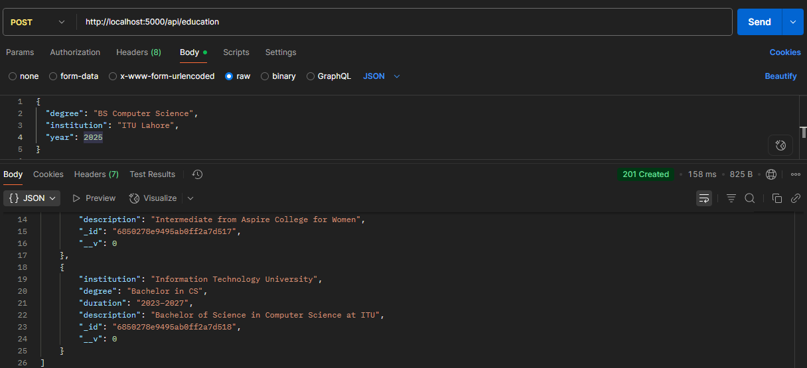

- **GET**  
  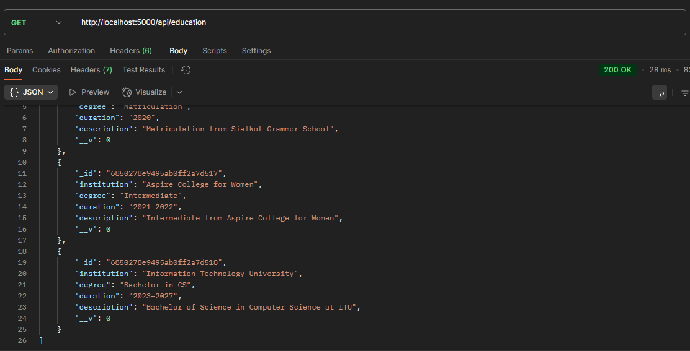

- **PUT**  
  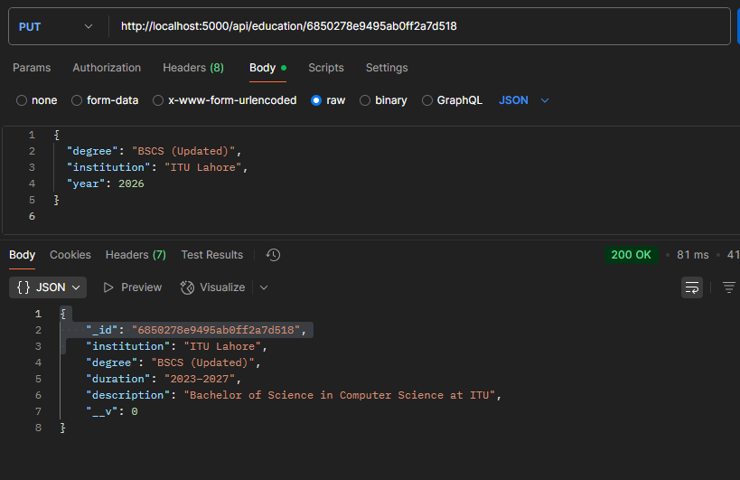

- **DELETE**  
  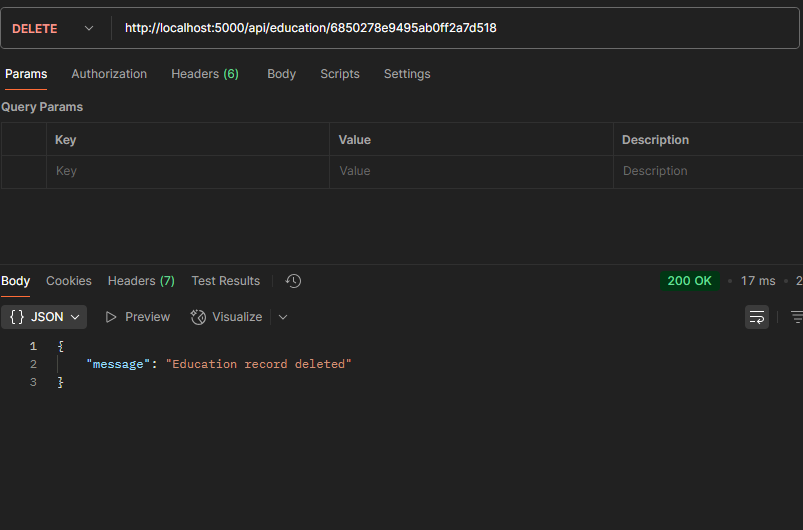

---

### 📗 Skills

- **POST**  
  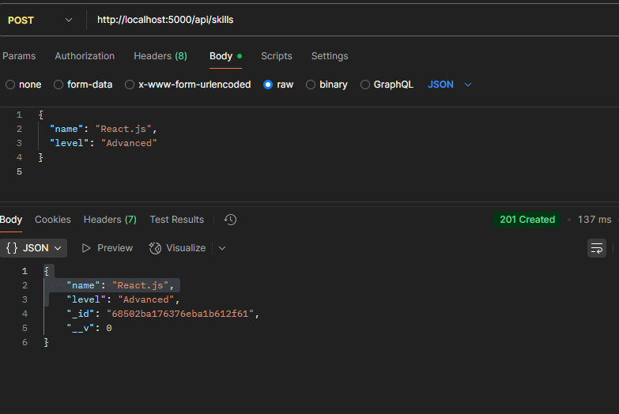

- **GET**  
  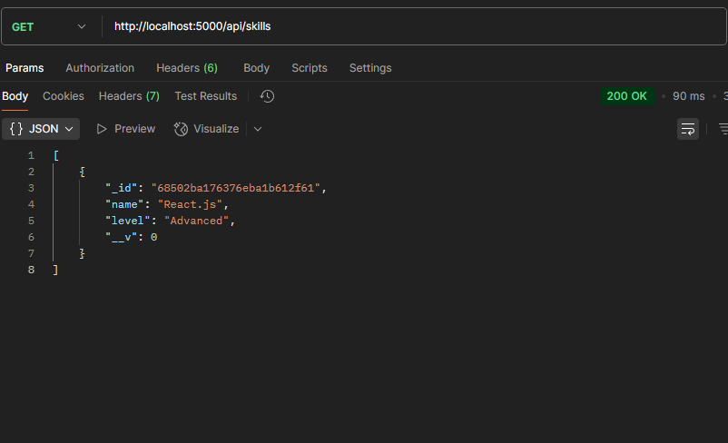

- **PUT**  
  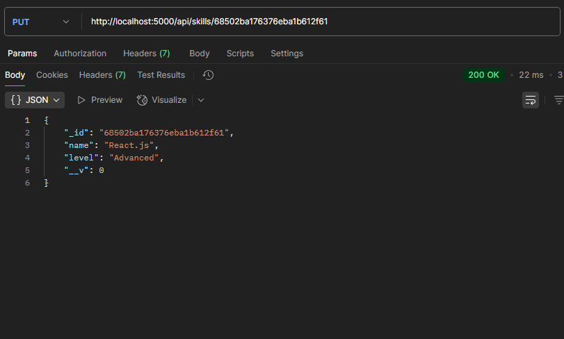

- **DELETE**  
  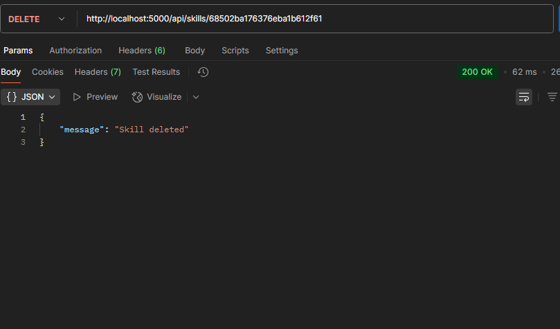

---

### 📙 Projects

- **POST**  
  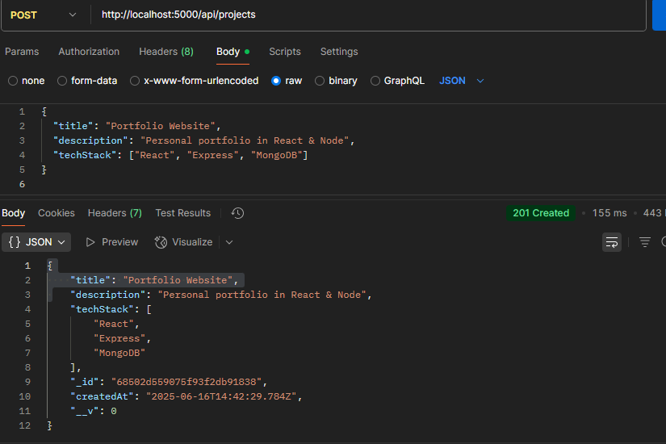

- **GET**  
  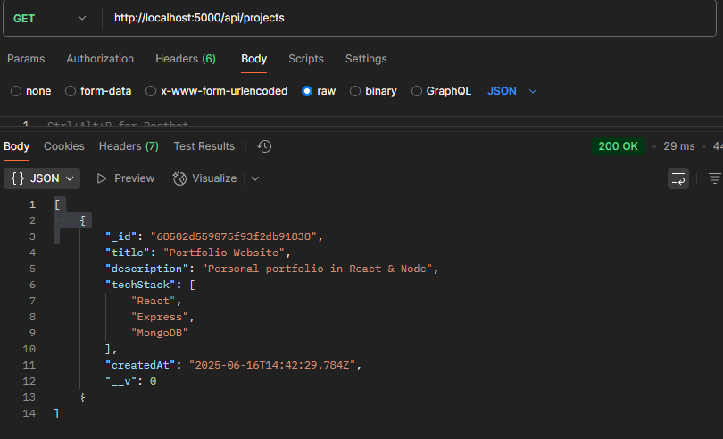

- **PUT**  
  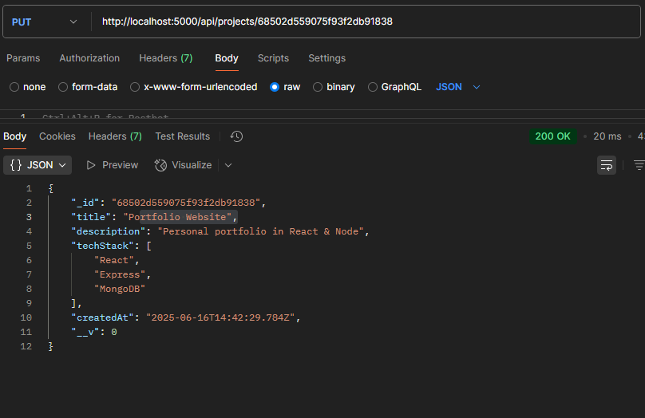

- **DELETE**  
  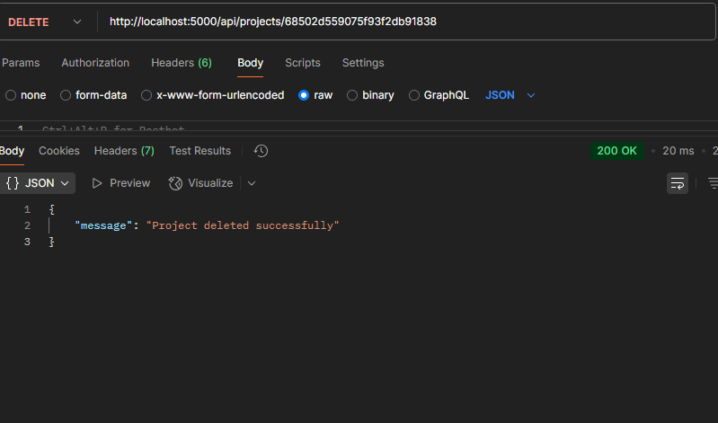

---

### 📕 Experience

- **POST**  
  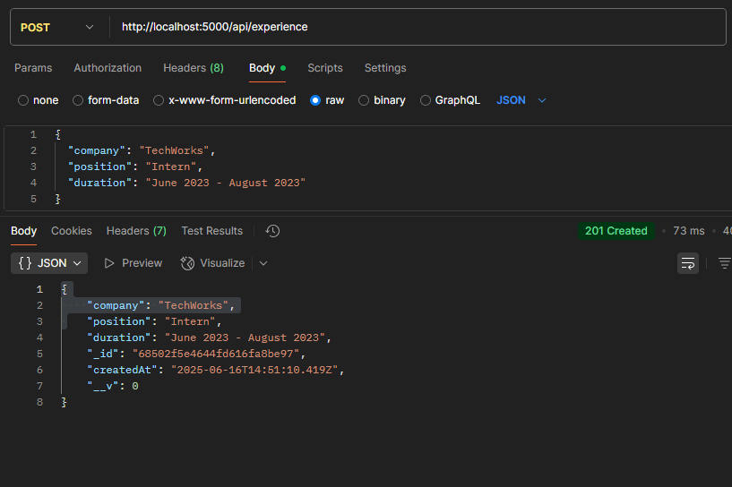

- **GET**  
  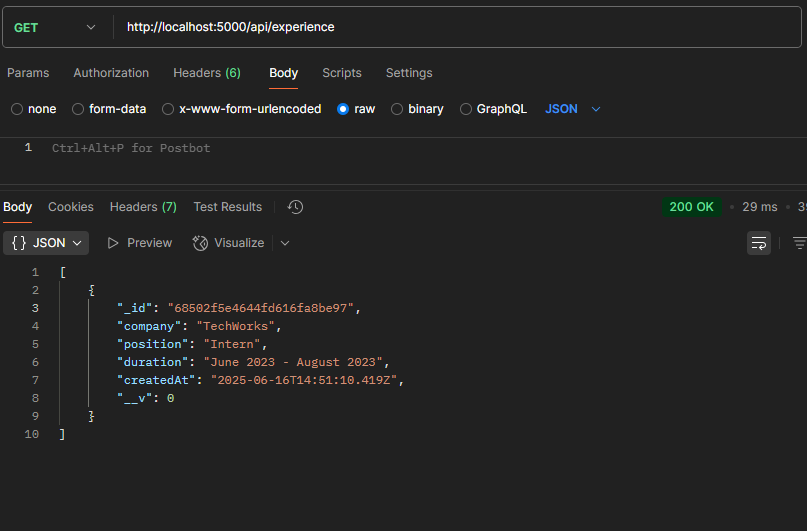

- **PUT**  
  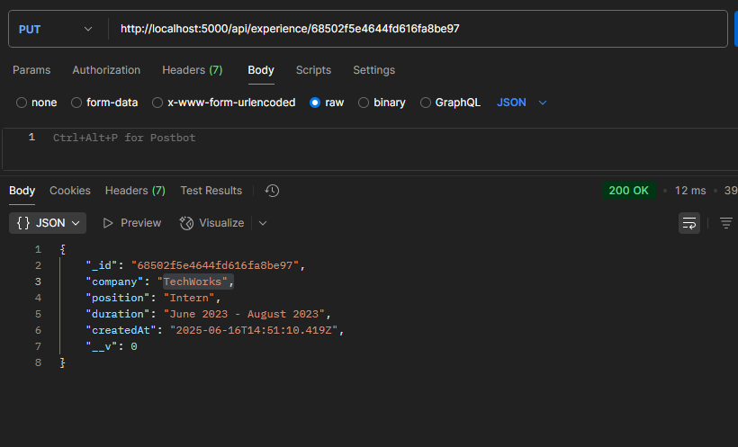

- **DELETE**  
  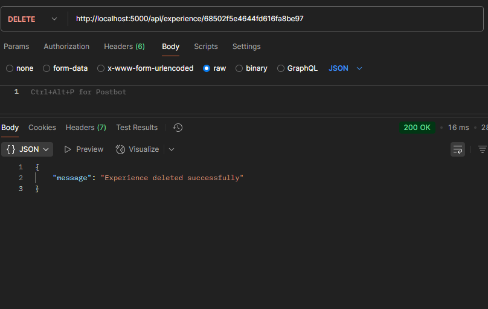

---

## 🔀 Git Workflow

- Git initialized with `.gitignore`
- Each feature was built on a separate branch:
  - `feature/mongodb-connection`
  - `feature/education-crud`
  - `feature/frontend-integration`
- Descriptive commit messages
- Pull requests used for clean merge to `main`

---

## 🧪 How to Run Locally

```bash
git clone https://github.com/MeerabAfzal/Portfolio_Backend.git
cd Portfolio_Backend
npm install
npm start
```

Runs on:  
📍 `http://localhost:5000`

---

## 🏁 Final Notes

- Backend fully tested using Postman  
- Screenshots added under `/assets`  
- MongoDB connected using Mongoose  
- Clean REST APIs and repo structure  
- Ready for frontend integration

---

**Made with 💻 for ITU Assignment #04**
